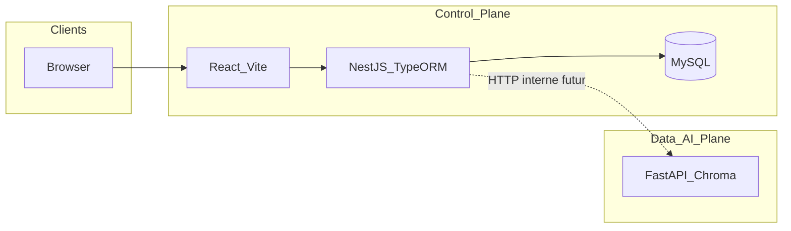

# Synapse IA — documentation technique

Document de référence : architecture, stacks, ports, contrats entre composants. Hors tutoriel produit.

## Découpage logique

| Plan | Rôle | Implémentation |
|------|------|----------------|
| **Control Plane** | Comptes, métadonnées métier, persistance relationnelle des entités SaaS | `saas/backend` (NestJS + TypeORM + MySQL), `saas/frontend` (React + Vite + Tailwind) |
| **Data / AI Plane** | Ingestion PDF/TXT, embeddings, stockage vectoriel, chat RAG, appels LLM | `agent` (FastAPI + ChromaDB + Gemini ou OpenAI) |

Le Control Plane est la source de vérité pour **User**, **Agent** (métadonnées), **Document** (statut, nom de fichier), **ChatSession**, **Message**. L’agent exécute le **traitement** des fichiers et le **retrieval** ; il identifie les tenants par chaînes **`user_id`** et **`agent_id`** passées en query ou body.

## Ports (référence)

| Service | Port par défaut | Notes |
|---------|-----------------|--------|
| NestJS Control API | **8547** | `PORT` dans `.env` du backend |
| Vite (frontend) | **8548** | `vite.config.ts` + Docker |
| Agent FastAPI (dans le conteneur) | **8000** | Port **hôte** : `API_PORT` (défaut **8546** dans le compose racine, `${API_PORT:-8546}:8000`) ; surcharger avec `agent/.env` via `docker compose --env-file .env --env-file agent/.env` |
| phpMyAdmin | **8550** | `PHPMYADMIN_PORT` — UI web sur MySQL interne (`PMA_HOST=mysql`) |

MySQL : port **3306** par défaut quand le service est lancé via le compose racine (`MYSQL_PORT` dans `.env` à la racine).

### Orchestration Docker (racine du dépôt)

- **[`docker-compose.yml`](../docker-compose.yml)** : services **`mysql`**, **`phpmyadmin`** (image `phpmyadmin/phpmyadmin:5`, `PMA_HOST=mysql`), **`backend`**, **`frontend`**, **`agent`** (build `./agent`, volumes `chroma_data`, `agent_profiles`, `logs`). Publication agent : **`${API_PORT:-8546}:8000`**. Variables : **`.env`** racine (MySQL, `API_PORT` si pas d’import depuis `agent/.env`) et **`agent/.env`** (clés LLM, etc.) ; pour résoudre `API_PORT` depuis `agent/.env` : `docker compose --env-file .env --env-file agent/.env up`.
- **[`docker-compose.dev.yml`](../docker-compose.dev.yml)** : développement — montages hot reload pour `backend`, `frontend` et `agent` (Nest `start:dev`, Vite, `uvicorn --reload`).

## Control Plane — backend (`saas/backend`)

- **Stack :** NestJS, TypeORM, MySQL (`mysql2`), configuration via `@nestjs/config`.
- **Module** `DatabaseModule` : `TypeOrmModule.forRootAsync`, `synchronize: true` uniquement si `NODE_ENV !== 'production'`.
- **Entités** (tables) : `User`, `ApiKey`, `Agent`, `Document`, `ChatSession`, `Message` — voir `src/database/entities/`.
- **Enums** : `DocumentStatus` (`PENDING`, `PROCESSING`, `READY`, `FAILED`), `MessageRole` (`USER`, `ASSISTANT`).

## Control Plane — frontend (`saas/frontend`)

- **Stack :** React 19, TypeScript, Vite 8, TailwindCSS 3, Axios (installé).
- État livré : application minimale validant Tailwind ; pas d’appels API métier encore.

## Data / AI Plane — agent (`agent`)

### Stack

- **FastAPI**, **Uvicorn**, **ChromaDB** (persistance des embeddings + métadonnées incluant `user_id`, `agent_id`), **LangChain** (découpe de texte), **PyMuPDF**, **httpx**.
- LLM : **Google Gemini** ou **OpenAI** selon `LLM_PROVIDER` et clés dans `.env`.

### Point d’entrée

- Fichier [`agent/app/main.py`](../agent/app/main.py) : enregistrement des routeurs `documents`, `agents`, `chat` ; au démarrage : configuration des logs, création des répertoires Chroma / profils, initialisation de la collection Chroma.

### Sécurité des routes internes

- Toutes les routes sous `/internal/v1` passent par [`agent/app/core/auth.py`](../agent/app/core/auth.py) : si `INTERNAL_API_KEY` est défini dans l’environnement, l’en-tête **`X-API-Key`** doit correspondre ; sinon la vérification est désactivée (réservé au développement ou réseau fermé).

### API (aperçu)

- Préfixe **`/internal/v1`** — détail des chemins, méthodes et corps : [`agent/README.md`](../agent/README.md).
- **Documents :** ingestion asynchrone (`job_id`), statut, liste, suppression par fichier ou tout le tenant.
- **Agents :** profils (nom + description fichier `.txt`) stockés côté service.
- **Chat :** JSON avec `user_id`, `agent_id`, `query`, historique optionnel, etc.

### Données locales au service

- Collection Chroma (`global_collection_name` dans la config).
- Fichiers de profils agents sous `AGENT_PROFILES_PATH`.
- Journaux fichier sous `LOG_DIR`.

### Docker (orchestration)

- L’agent est construit et publié uniquement via le **[`docker-compose.yml`](../docker-compose.yml)** à la racine du dépôt (plus de compose dans `agent/`).

## Intégration future (Nest ↔ agent)

- Le Control Plane persiste des **UUID** (MySQL) pour utilisateurs et agents.
- L’agent attend **`user_id`** et **`agent_id`** comme **chaînes** dans ses requêtes.
- Lors du branchement applicatif, il faudra une règle explicite : par exemple transmettre les UUID en string, ou maintenir un mapping — hors périmètre de l’init actuelle.

## Topologie (logique)

