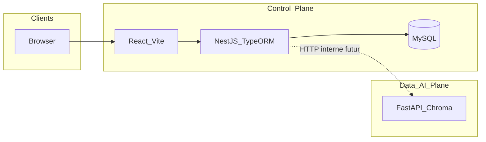

# Synapse IA — documentation technique

Document de référence : architecture, stacks, ports, contrats entre composants. Hors tutoriel produit.

## Découpage logique

| Plan | Rôle | Implémentation |
|------|------|----------------|
| **Control Plane** | Comptes, métadonnées métier, persistance relationnelle des entités SaaS | `saas/backend` (NestJS + TypeORM + MySQL), `saas/frontend` (React + Vite + Tailwind) |
| **Data / AI Plane** | Ingestion PDF/TXT, embeddings, stockage vectoriel, chat RAG, appels LLM | `agent` (FastAPI + ChromaDB + Gemini ou OpenAI) |

Le Control Plane est la source de vérité pour **User**, **Agent** (métadonnées), **Document** (statut, nom de fichier), **ChatSession**, **Message**. L’agent exécute le **traitement** des fichiers et le **retrieval** ; il identifie les tenants par chaînes **`user_id`** et **`agent_id`** passées en query ou body.

## Ports (référence)

| Service | Port par défaut | Notes |
|---------|-----------------|--------|
| NestJS Control API | **8547** | `PORT` dans `.env` du backend |
| Vite (frontend) | **8548** | `vite.config.ts` + Docker |
| Agent FastAPI (dans le conteneur) | **8000** | Port **hôte** : `API_PORT` (défaut **8546** dans le compose racine, `${API_PORT:-8546}:8000`) ; surcharger avec `agent/.env` via `docker compose --env-file .env --env-file agent/.env` |
| phpMyAdmin | **8550** | `PHPMYADMIN_PORT` — UI web sur MySQL interne (`PMA_HOST=mysql`) |

MySQL : port **3306** par défaut quand le service est lancé via le compose racine (`MYSQL_PORT` dans `.env` à la racine).

### Orchestration Docker (racine du dépôt)

- **[`docker-compose.yml`](../docker-compose.yml)** : services **`mysql`**, **`phpmyadmin`** (image `phpmyadmin/phpmyadmin:5`, `PMA_HOST=mysql`), **`backend`**, **`frontend`**, **`agent`** (build `./agent`, Chroma en bind mount `./agent/chroma_data`, volume `logs`). Publication agent : **`${API_PORT:-8546}:8000`**. Variables : **`.env`** racine (MySQL, `API_PORT` si pas d’import depuis `agent/.env`) et **`agent/.env`** (clés LLM, etc.) ; pour résoudre `API_PORT` depuis `agent/.env` : `docker compose --env-file .env --env-file agent/.env up`.
- **[`docker-compose.dev.yml`](../docker-compose.dev.yml)** : développement — montages hot reload pour `backend`, `frontend` et `agent` (Nest `start:dev`, Vite, `uvicorn --reload`). Volumes **`backend_node_modules`** / **`frontend_node_modules`** : au démarrage, **`npm ci`** conditionnel si des paquets attendus manquent (voir commandes dans le fichier).

## Control Plane — backend (`saas/backend`)

- **Stack :** NestJS, TypeORM, MySQL (`mysql2`), configuration via `@nestjs/config`.
- **Module** `DatabaseModule` : `TypeOrmModule.forRootAsync`, `synchronize: true` uniquement si `NODE_ENV !== 'production'`.
- **Entités** (tables) : `User`, **`user_auth_tokens`** (jetons hashés : réinitialisation mot de passe, vérification e-mail), `ApiKey`, `Agent`, `Document`, `ChatSession`, `Message` — voir `src/database/entities/`.
- **Clés primaires et identifiants publics :** chaque entité a un **`id`** numérique auto-incrémenté et un champ **`identifier`** (`varchar(36)`, UUID unique, généré au `BeforeInsert`) pour l’exposition API / références stables. **`User.identifier`** est le **`sub`** JWT ; **`User.username`** est requis à l’inscription (unique, normalisé en minuscules).
- **Enums** : `DocumentStatus` (`PENDING`, `PROCESSING`, `READY`, `FAILED`), `MessageRole` (`USER`, `ASSISTANT`).

### Vérification d’e-mail (inscription e-mail / mot de passe)

- Après **`POST /auth/register`**, aucun JWT n’est retourné : un e-mail contient un lien vers **`GET /api/v1.0/auth/verify-email?token=...`** (sans **`X-API-Key`** dans le navigateur). **`BACKEND_PUBLIC_URL`** dans `.env` doit être l’URL joignable depuis l’e-mail (souvent `http://localhost:8547` en local).
- **`POST /auth/resend-verification`** `{ "email" }` : renvoie un lien (compte existant, non vérifié).
- Tant que **`email_verified_at`** est null, **`POST /auth/login`** et **`POST /auth/refresh`** échouent avec **`403`** et code **`EMAIL_NOT_VERIFIED`** pour les comptes avec mot de passe.
- Comptes **Google OAuth** : **`email_verified_at`** est renseigné à la création / liaison.
- **Bases déjà peuplées avant cette fonctionnalité** : exécuter un script SQL pour marquer les comptes existants comme vérifiés si besoin, par ex.  
  `UPDATE users SET email_verified_at = COALESCE(email_verified_at, created_at) WHERE password IS NOT NULL;`

### Google OAuth (optionnel)

- Variables **`GOOGLE_CLIENT_ID`**, **`GOOGLE_CLIENT_SECRET`**, **`GOOGLE_CALLBACK_URL`** (ex. `http://localhost:8547/api/v1.0/auth/google/callback`) : si les trois sont définies, le backend expose **`GET /api/v1.0/auth/google`** et **`GET /api/v1.0/auth/google/callback`** (sans exiger **`X-API-Key`** sur ces chemins — navigation navigateur).
- **Origines JavaScript autorisées** (console Google) : origine du front, ex. **`http://localhost:8548`**.
- **URI de redirection autorisées** : identique à **`GOOGLE_CALLBACK_URL`**.
- Front : **`VITE_GOOGLE_AUTH_ENABLED=true`** pour afficher le bouton sur `/login` ; après succès, redirection vers **`/auth/google/callback`** avec les JWT dans le fragment d’URL.

### Sécurité HTTP — `X-API-Key` (Control API)

- Toute requête vers **`/api/v1.0/*`** doit envoyer l’en-tête **`X-API-Key`** avec un secret autorisé. Les requêtes **`OPTIONS`** (preflight CORS) sont exemptées de cette vérification.
- **Configuration** (priorité) : variable **`API_KEYS_JSON`** (tableau JSON `[{ "name": "...", "token": "..." }]`) ; sinon fichier **`API_KEYS_FILE`** (défaut `config/api-keys.local.json` relatif au cwd). Exemple versionné : **`config/api-keys.example.json`**. Chargement : [`saas/backend/src/config/load-api-keys.ts`](../saas/backend/src/config/load-api-keys.ts). Sans clés configurées, le processus refuse de démarrer.
- **CORS** : `allowedHeaders` inclut notamment **`Authorization`** et **`X-API-Key`** (voir [`main.ts`](../saas/backend/src/main.ts)).
- **Auth applicative** : inchangée — **`JwtAuthGuard`** global + décorateur **`@Public()`** sur login, register, etc.

### Swagger UI

- URL : **`http://<host>:<PORT>/docs`** (hors préfixe `/api/v1.0`). **HTTP Basic** (navigateur) : variables **`SWAGGER_USER`** / **`SWAGGER_PASSWORD`** (défaut documentés dans `.env.example`). Le document OpenAPI inclut le schéma Bearer JWT et le schéma **`X-API-Key`** pour les tests dans l’UI.

### Docker — dépendances Node (backend)

- Image : [`saas/backend/Dockerfile`](../saas/backend/Dockerfile) — `COPY package.json` + `package-lock.json` puis **`npm ci`** à chaque build.
- **`docker-compose.dev.yml`** : volume nommé **`backend_node_modules`** ; au démarrage du conteneur, si des paquets attendus manquent (ex. **`@nestjs/swagger`**, **`express-basic-auth`**), exécution de **`npm ci`** puis `npm run start:dev`. Après ajout de dépendances, rebuild ou supprimer le volume si besoin.

## Control Plane — frontend (`saas/frontend`)

- **Stack :** React 19, TypeScript, Vite 8, TailwindCSS 3, Axios (version **pinnée** — voir `package.json` et règles Cursor).
- **HTTP :** instance Axios [`src/lib/api.ts`](../saas/frontend/src/lib/api.ts) — URL de base **`VITE_API_URL`**, en-tête **`X-API-Key`** via **`VITE_API_KEY`** (aligné sur un `token` côté backend), **`Authorization: Bearer`** si jeton stocké.
- **Variables `VITE_*` :** `VITE_API_URL`, `VITE_API_KEY`, `VITE_APP_NAME` (branding auth / admin) — voir `.env.example`.
- **Routing :** préfixe API **`/api/v1.0`** ; UI admin sous **`/admin`** (`AdminLayout`), auth sous **`pages/auth`**. Animations de route : CSS dans `index.css` (`:root` **`--motion-duration`** / **`--motion-ease`**), pas d’animation globale sur `/admin` (animations locales shell + contenu).

## Data / AI Plane — agent (`agent`)

### Stack

- **FastAPI**, **Uvicorn**, **ChromaDB** (persistance des embeddings + métadonnées incluant `user_id`, `agent_id`), **LangChain** (découpe de texte), **PyMuPDF**, **httpx**.
- LLM : **Google Gemini** ou **OpenAI** selon `LLM_PROVIDER` et clés dans `.env`.

### Point d’entrée

- Fichier [`agent/app/main.py`](../agent/app/main.py) : enregistrement des routeurs `documents`, `chat` ; au démarrage : configuration des logs, création du répertoire Chroma, initialisation de la collection Chroma.

### Sécurité des routes internes

- Toutes les routes sous `/internal/v1` passent par [`agent/app/core/auth.py`](../agent/app/core/auth.py) : si `INTERNAL_API_KEY` est défini dans l’environnement, l’en-tête **`X-API-Key`** doit correspondre ; sinon la vérification est désactivée (réservé au développement ou réseau fermé).

### API (aperçu)

- Préfixe **`/internal/v1`** — détail des chemins, méthodes et corps : [`agent/README.md`](../agent/README.md).
- **Documents :** ingestion asynchrone (`job_id`), statut, liste, suppression par fichier ou tout le tenant.
- **Chat :** JSON avec `user_id`, `agent_id`, `query`, historique optionnel, et optionnellement `agent_name` / `agent_description` (périmètre du prompt — source de vérité côté Control Plane).

### Données locales au service

- Collection Chroma (`global_collection_name` dans la config).
- Journaux fichier sous `LOG_DIR`.

### Docker (orchestration)

- L’agent est construit et publié uniquement via le **[`docker-compose.yml`](../docker-compose.yml)** à la racine du dépôt (plus de compose dans `agent/`).

## Intégration future (Nest ↔ agent)

- Le Control Plane utilise des **`id`** numériques en base et des **`identifier`** (UUID) exposés ; l’agent attend **`user_id`** et **`agent_id`** comme **chaînes** dans ses requêtes.
- Lors du branchement applicatif, aligner les **`identifier`** (ou conventions de mapping) avec ces chaînes — hors périmètre détaillé ici.

## Topologie (logique)

